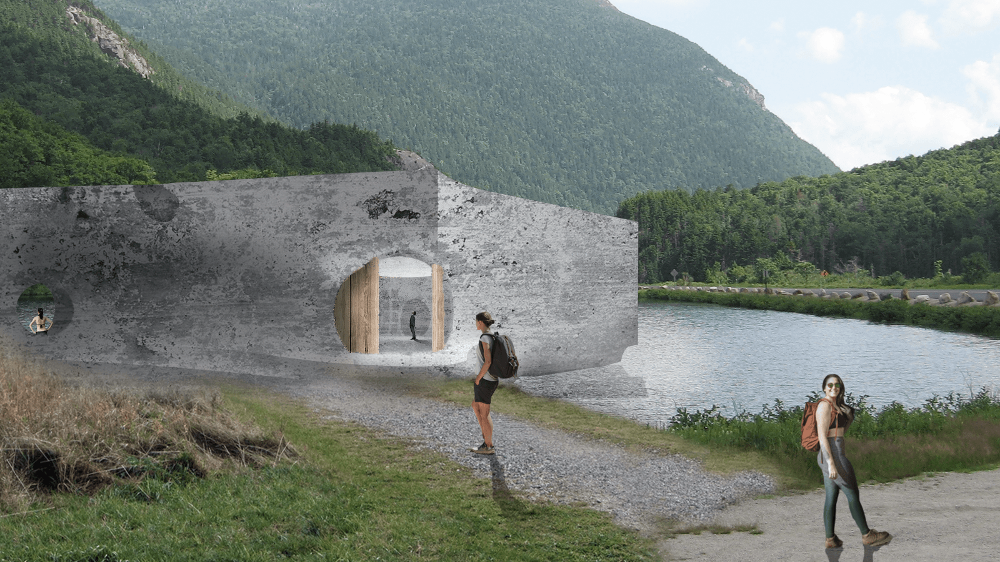
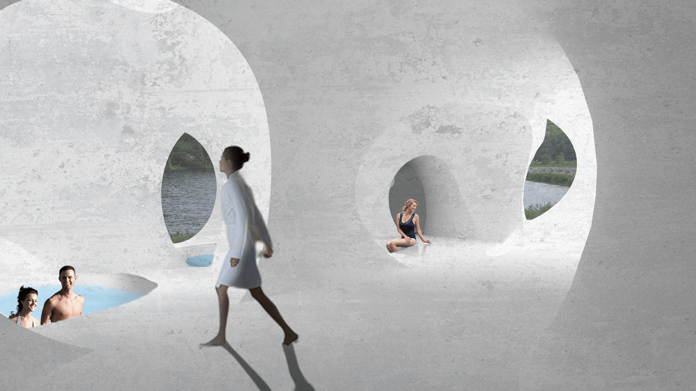
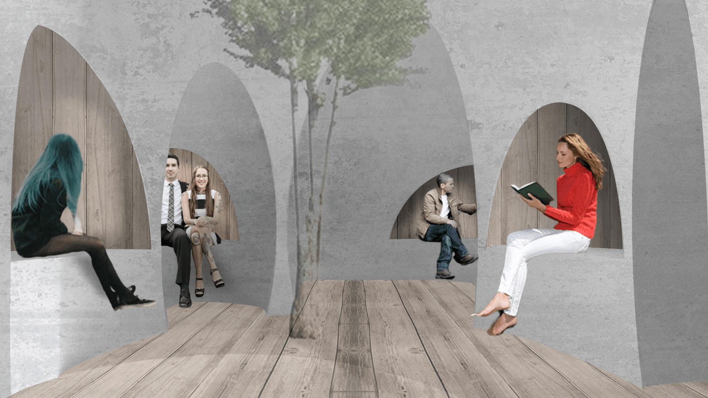
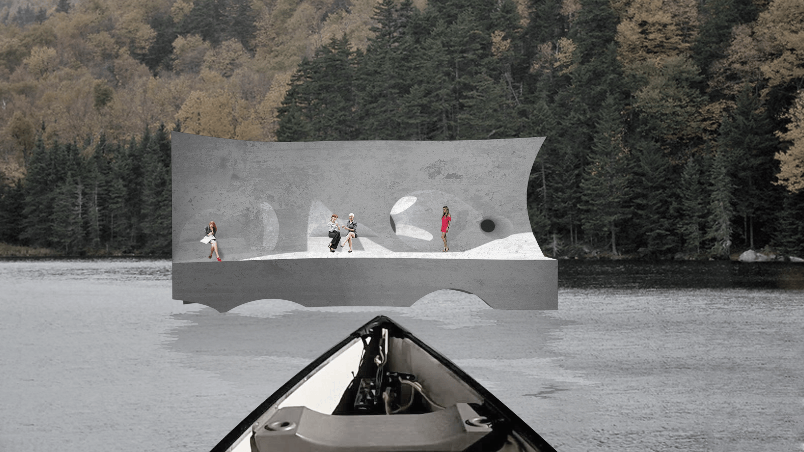
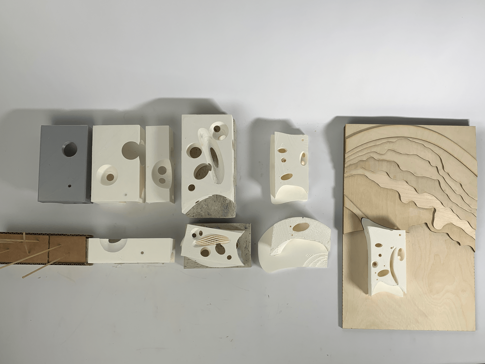
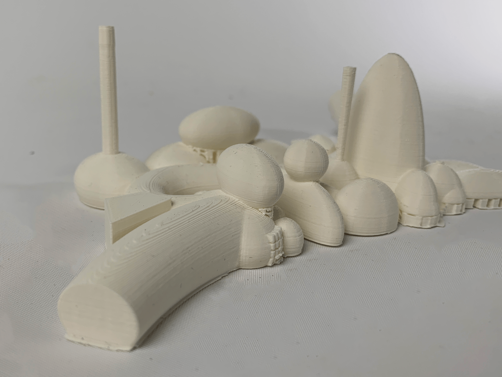
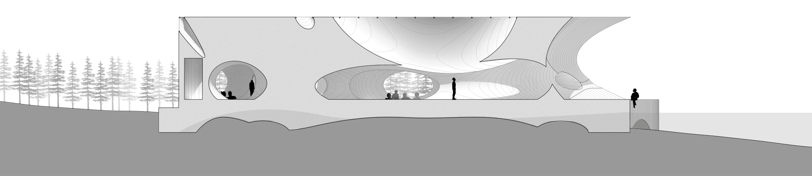
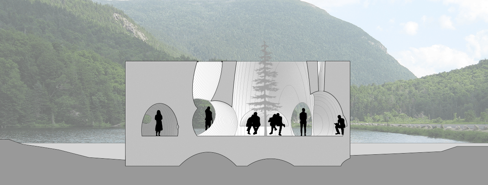

As part of the 2nd year Elaboration architecture studio at Carnegie Mellon, we were tasked with designing a bathhouse around Saco Lake in New Hampshire. The main design focuses of this project were the modulation of light and concrete wood interplay. To facilitate my design process, I used mass iteration and 3D printing. Through this project, I explored transparency, light, and procession controlled by a subtractive geometric language.

