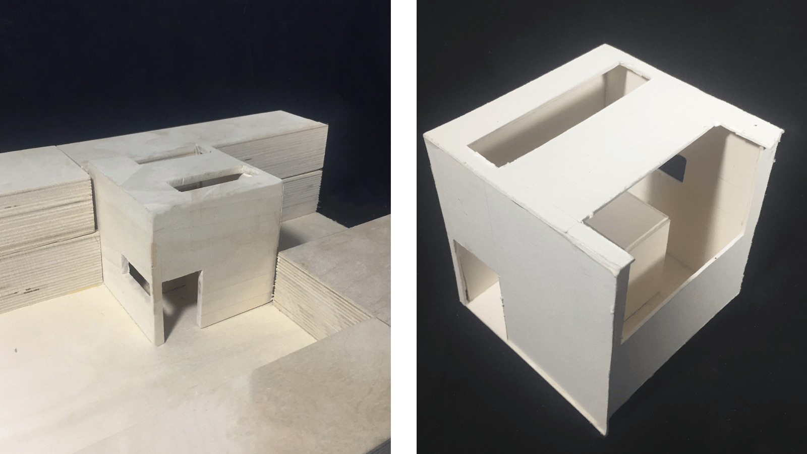
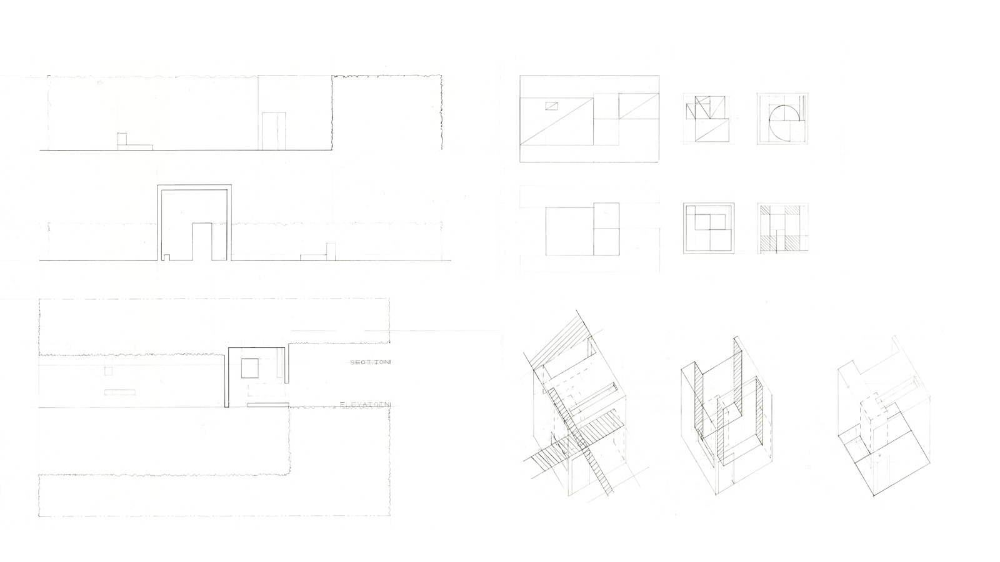

For the end of the first semester of Architecture studio at Carnegie Mellon, we were tasked with designing a pavilion that was meant to house a painting. My pavilion was a study in proportions based on the painting A Mother Delousing Her Child by Pieter De Hooch.

