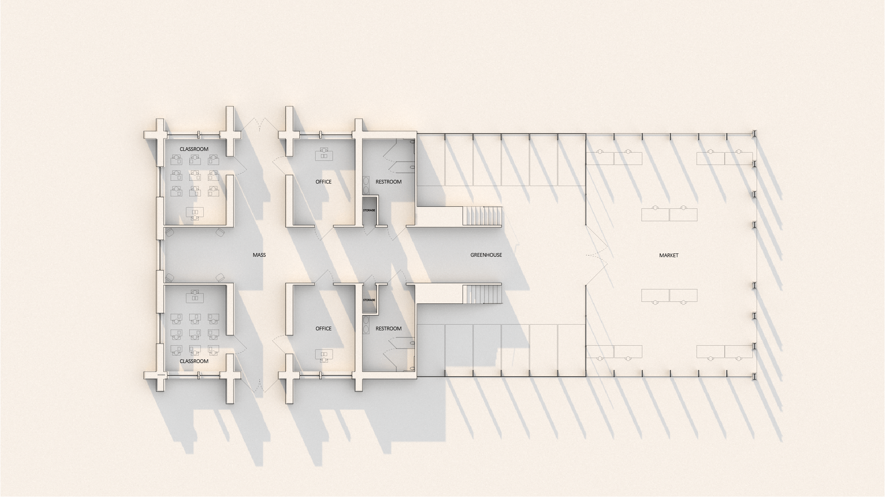

For the final project of A2 Grow Studio in Carnegie Mellon University's School of Architecture, we were tasked with designing a multi-use grow space in Pittsburgh's East Liberty neighborhood. This space allows for a classroom, outdoor covered farmer's market, and indoor grow space.

