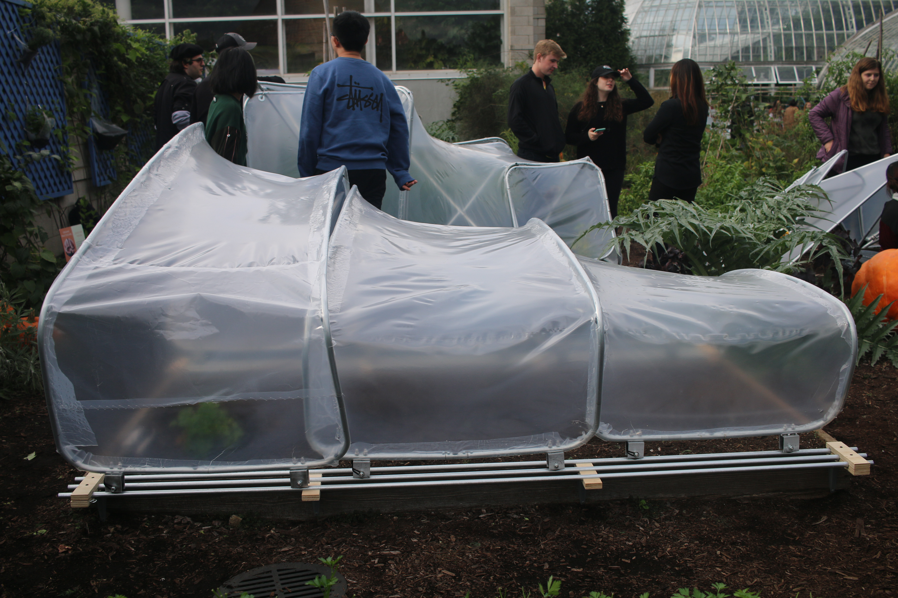
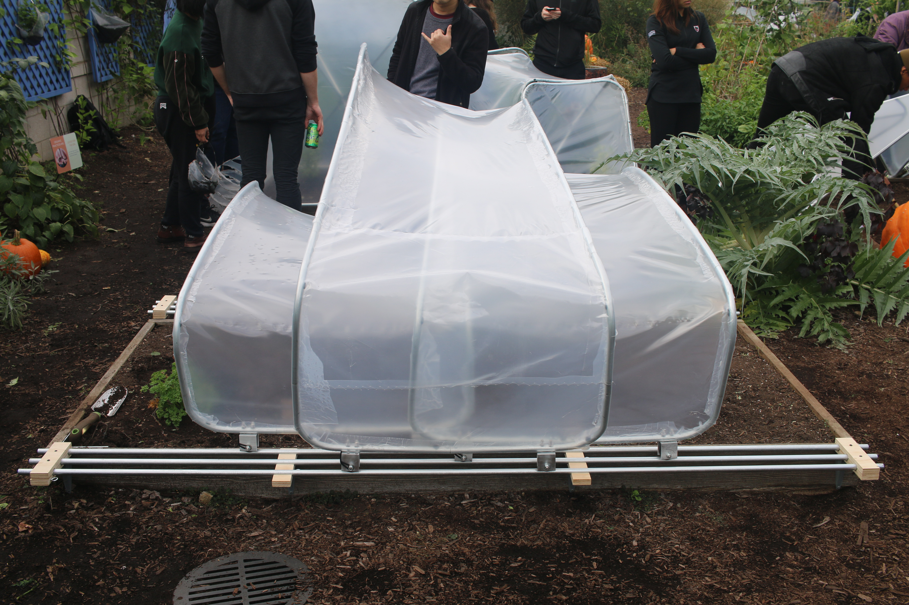
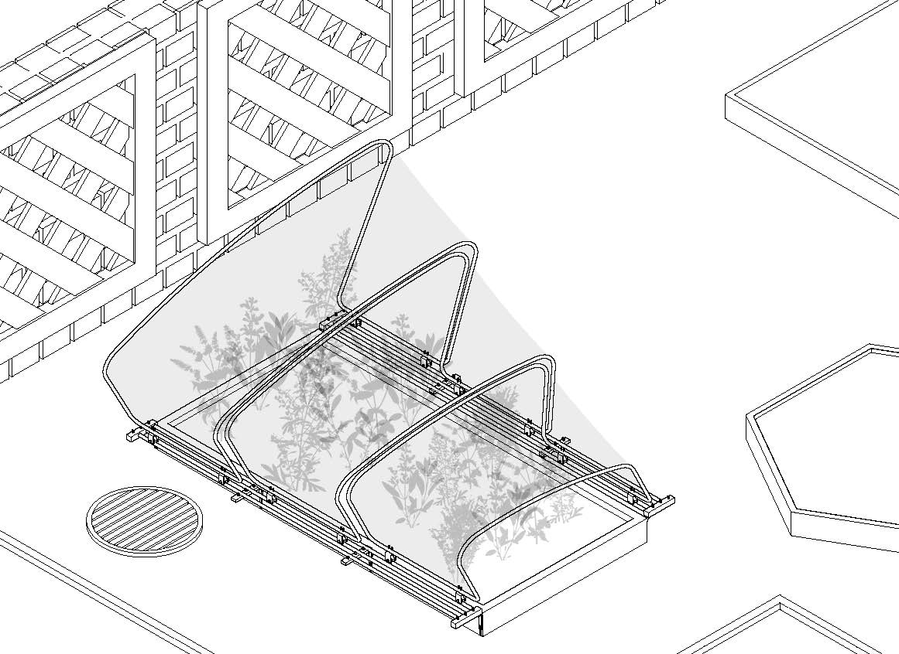
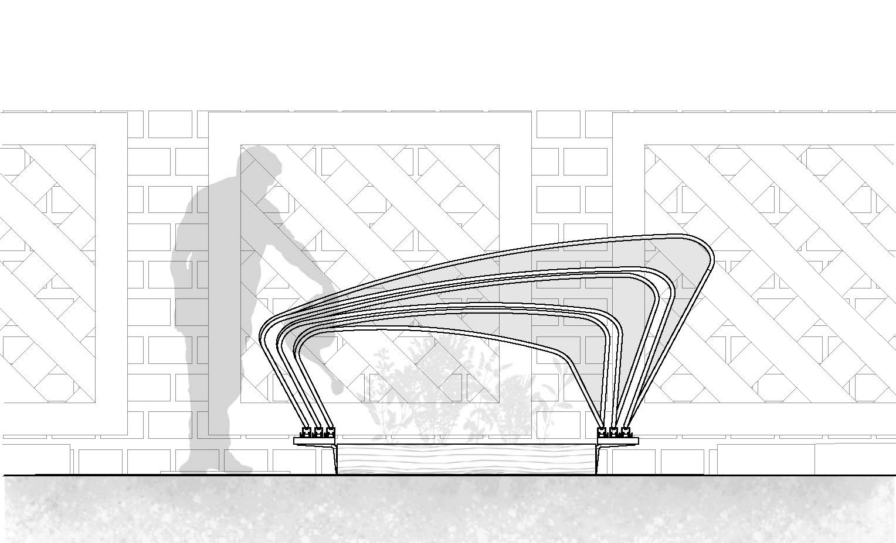
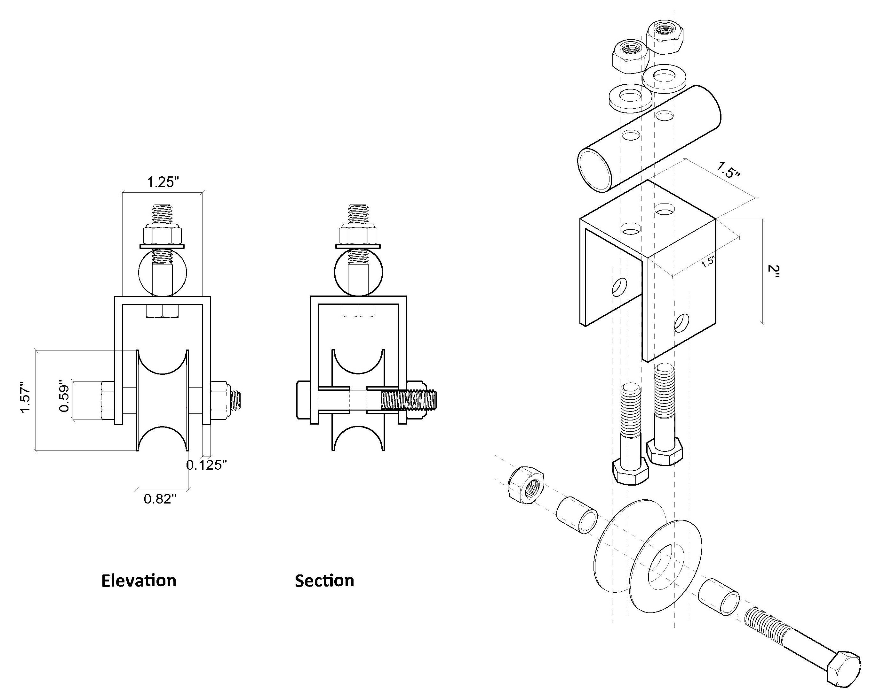
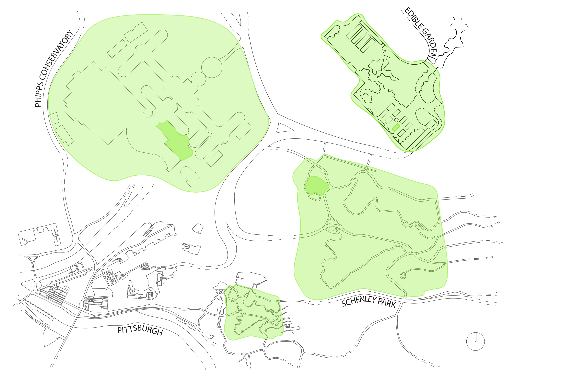
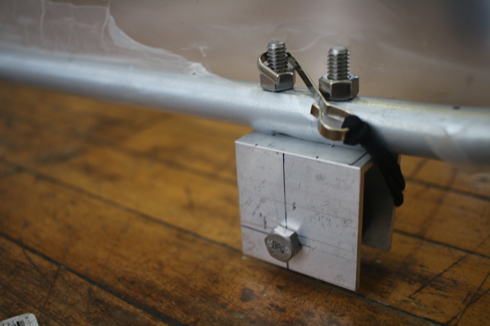
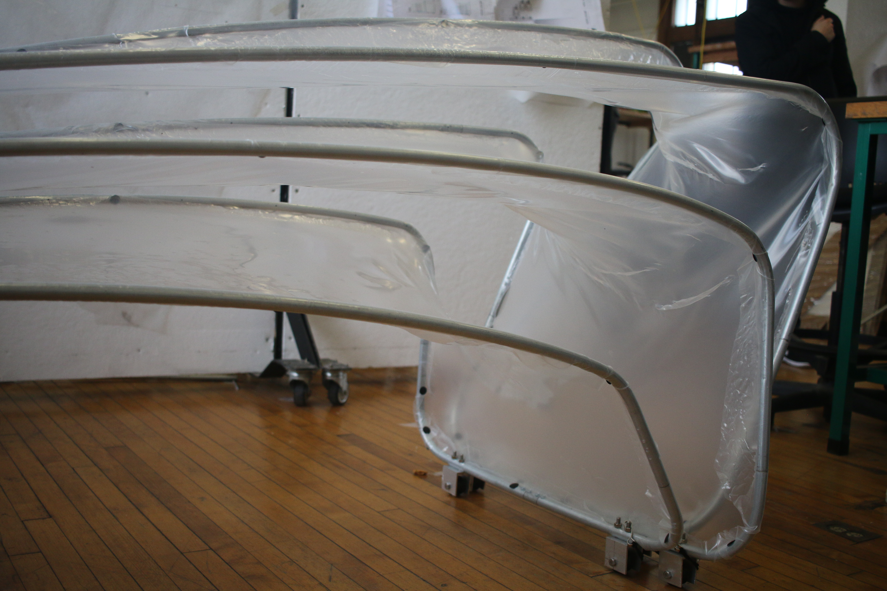
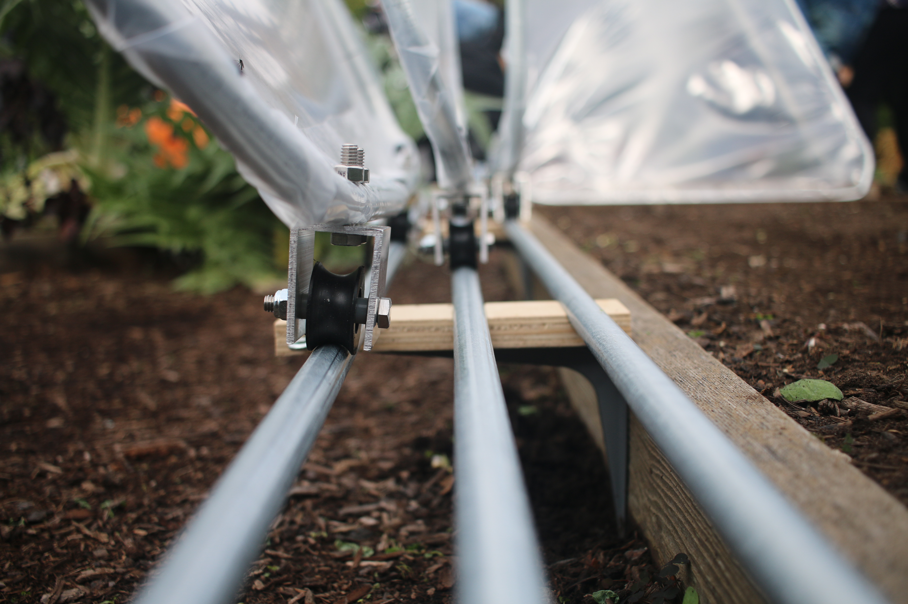

The second project of the grow collective studio is the hoop
house, a right of passage of sorts in the program. In groups,
we designed and implemented a mini greenhouse with the
goal of extending the growing season of the herbs contained
within the structure. My group, Roll With It, designed a
rolling structure meant to increase ease of access while
protecting plans from wind. The final fabricated structure was installed at Phipps conservatory in Pittsburgh, PA.
  
Project group: Lukas Hermann, Paul Greenway, Carly Sacco, Maya Greenholt & Isabella Giammatteo

