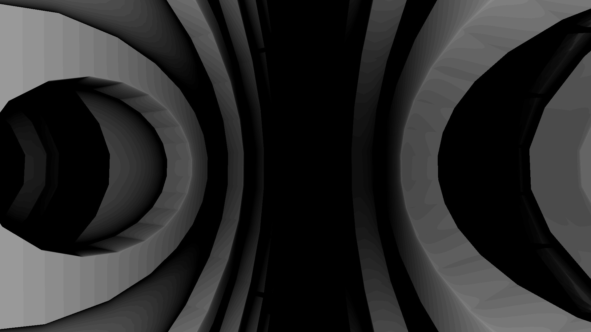
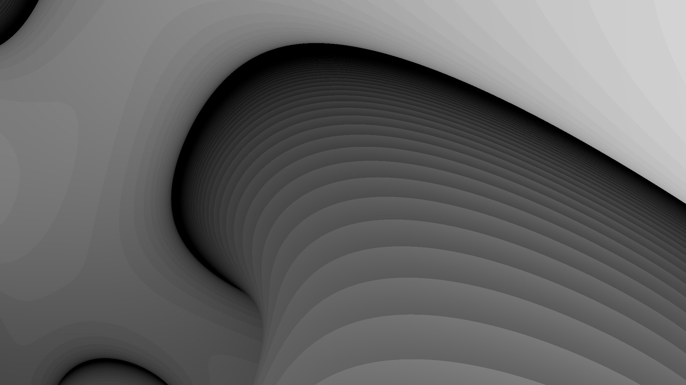
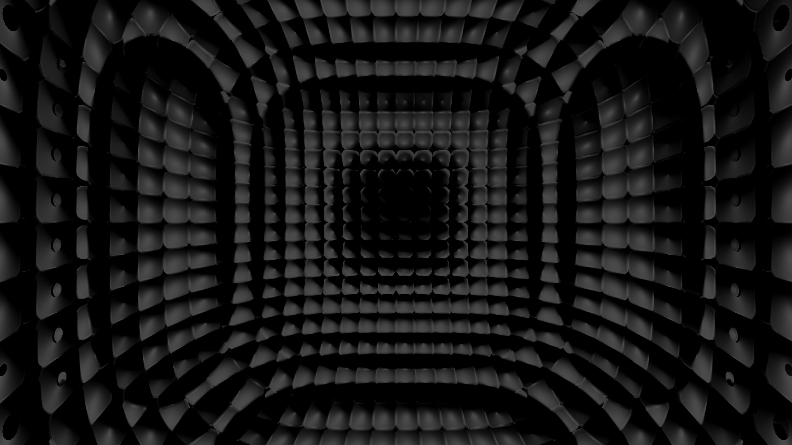
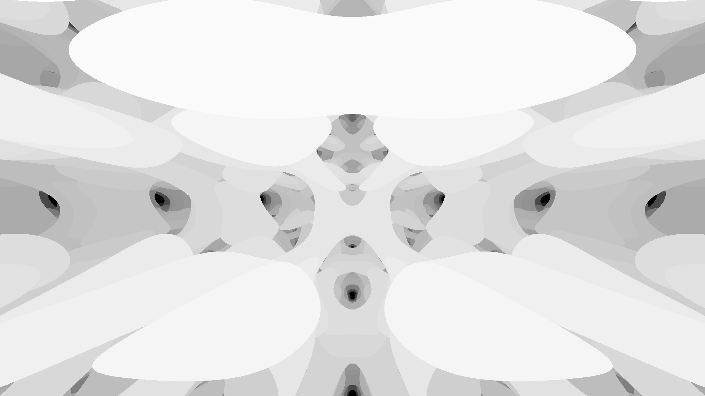
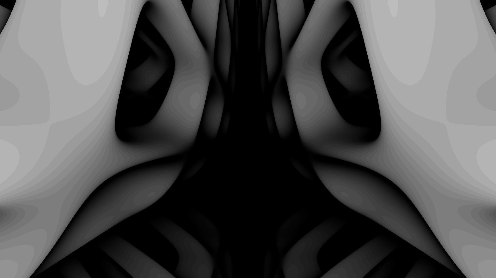

Lunar Gala is the largest annual fashion show in Pittsburgh. The show is organized and run by Carnegie Mellon University students. In my freshman year at the university, I was brought on as a motion designer to create a cohesive on-screen visual idenity to accompnay each line. I personally developed twenty two of the twenty six visuals that appeared on screen during the show.

