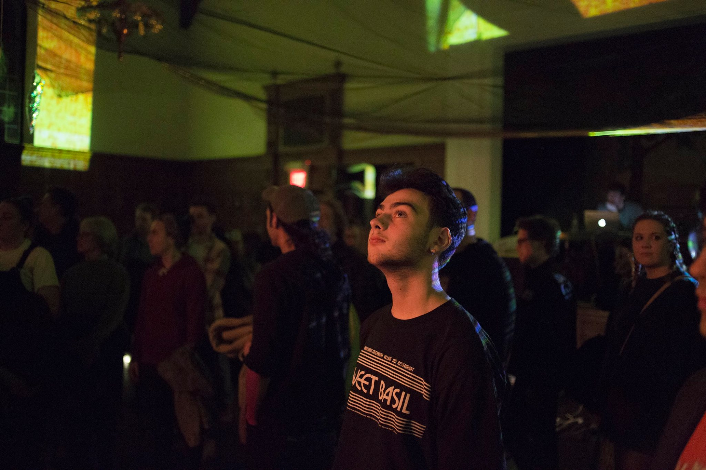
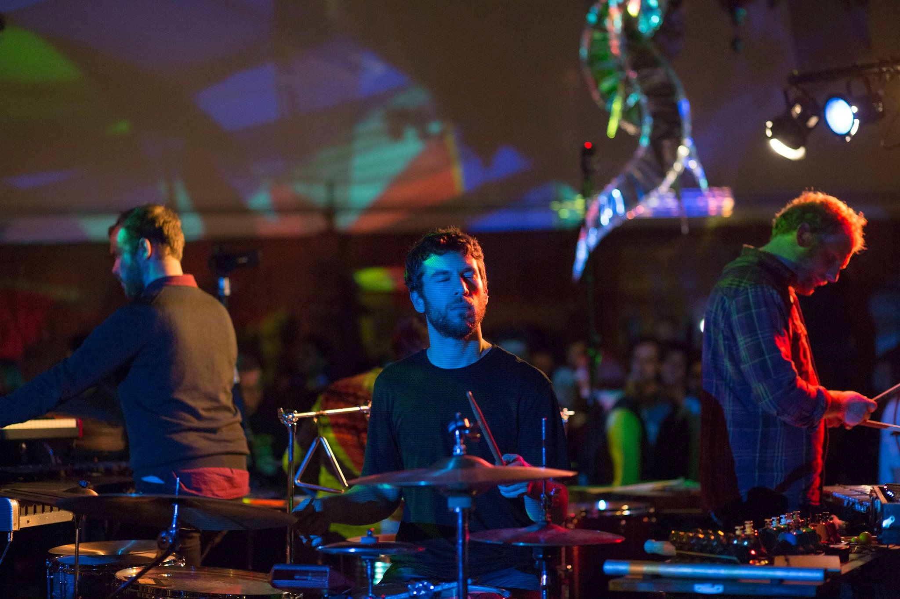

Naked Noise is an avante garde noise music festival that occurs in Ithaca, New York as part of Ithaca Underground.
During the event, 20 musicians form a circle and play at once in a room full of installation art.
As a result, viewers are treated to a garden of music that they can stroll through.
I was brought on to the visual team to project on some of the acts as an attempt to texture the performers.

