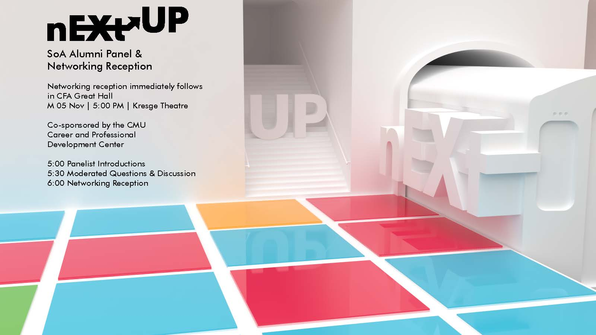

nEXt-UP is Carnegie Mellon University's School of Architecture's yearly event meant to show students what alumni are using their architecture degrees for post graduation. I was asked to create a brand logo and accompanying poster for the event as an extension of CMU SoA's Exchange brand. 

