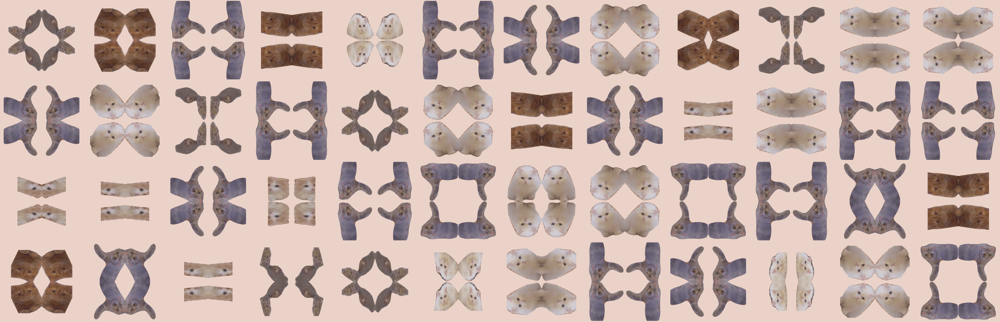

For my final project in Golan Levin & Nica Ross's Experimental Capture class, I produced a tool which uses Detectron2 to segment cute animals from video, and creates patterns from the segmentations.

