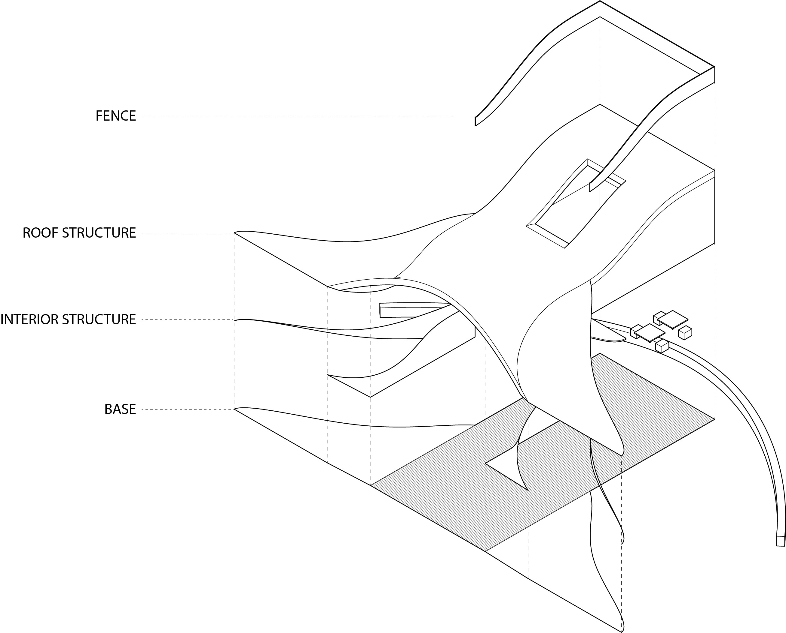
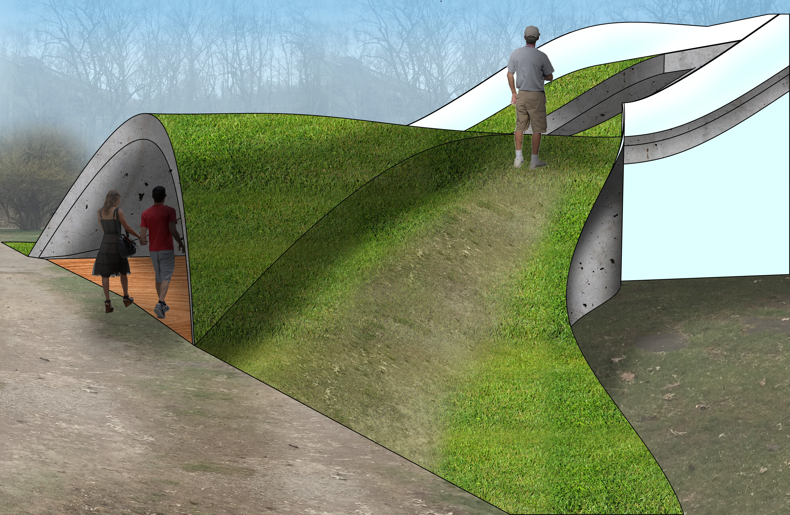
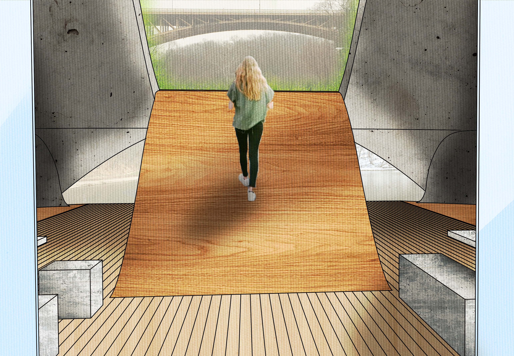

As the final project in the first year studio at Carnegie Mellon's School of Architecture, we were tasked with analysing a park in Pittsburgh, PA and designing a pavilion to give added function to the location. I was assigned Schenley Park, and focused on creating a picnic space near the lake while also offering a private space where on could take refuge from harsh weather.

