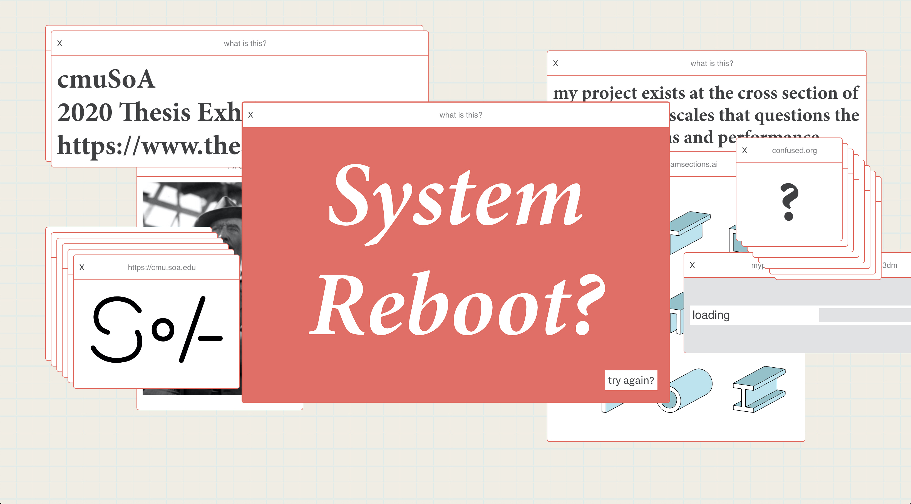
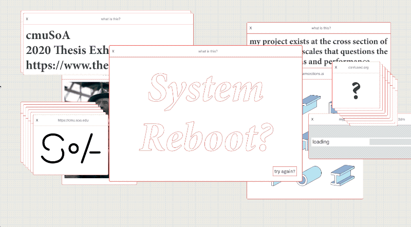
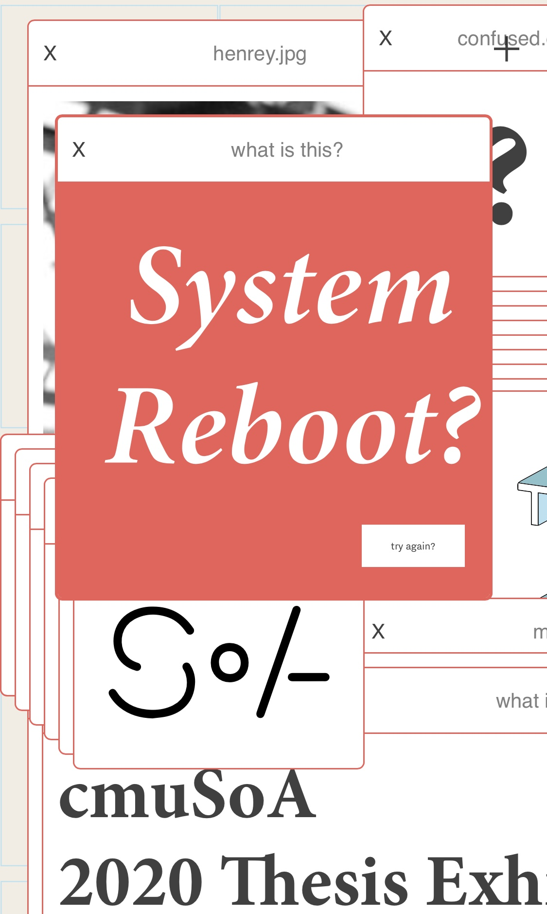

As development lead on Carnegie Mellon University's School of Architecture web presense in Spring 2020, I was tasked with creating a responsive homepage to greet those entering the [thesis gallery](http://thesis.soa.cmu.edu).

Design: Michael Powell, Rachel Park

Development: Lukas Hermann

