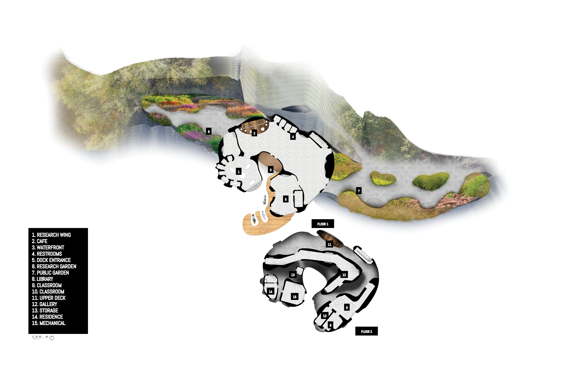
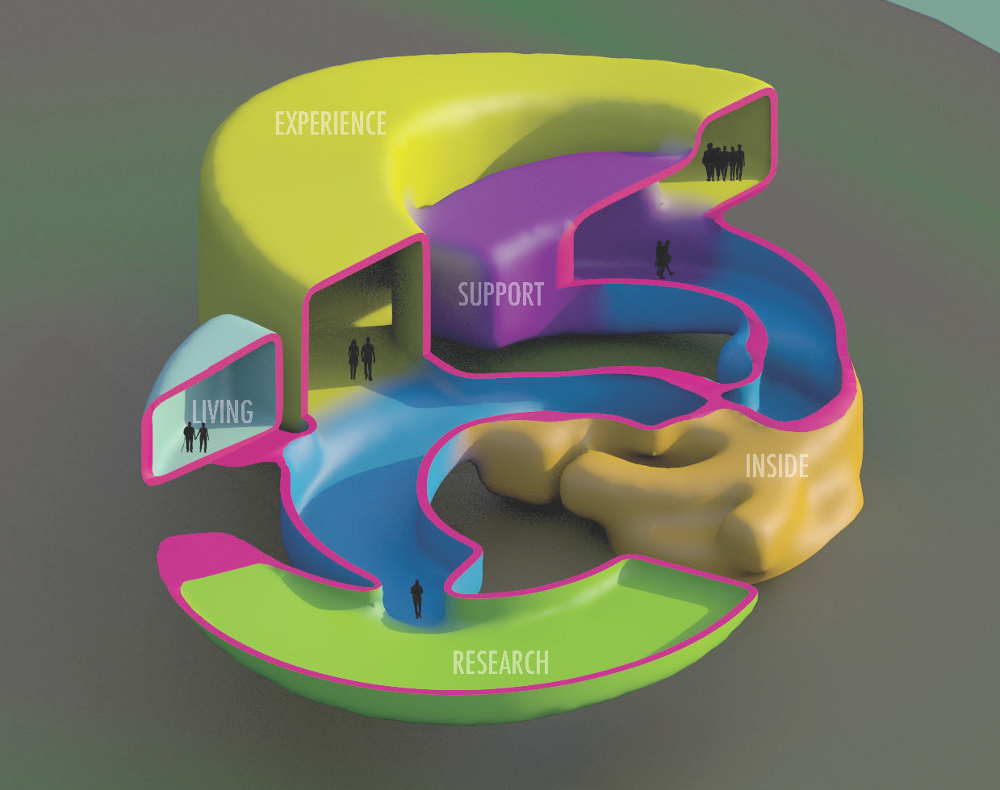
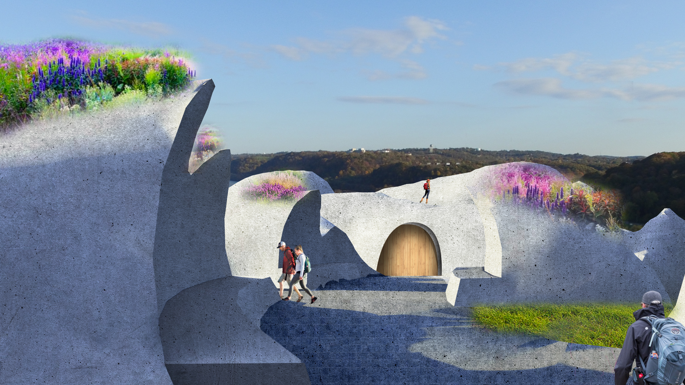
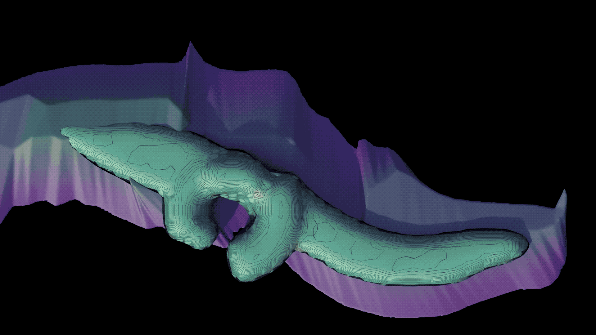
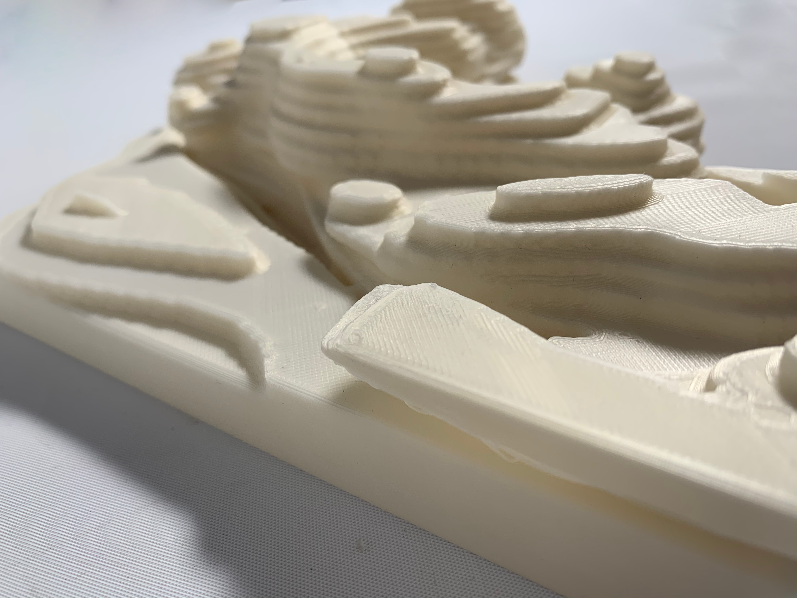
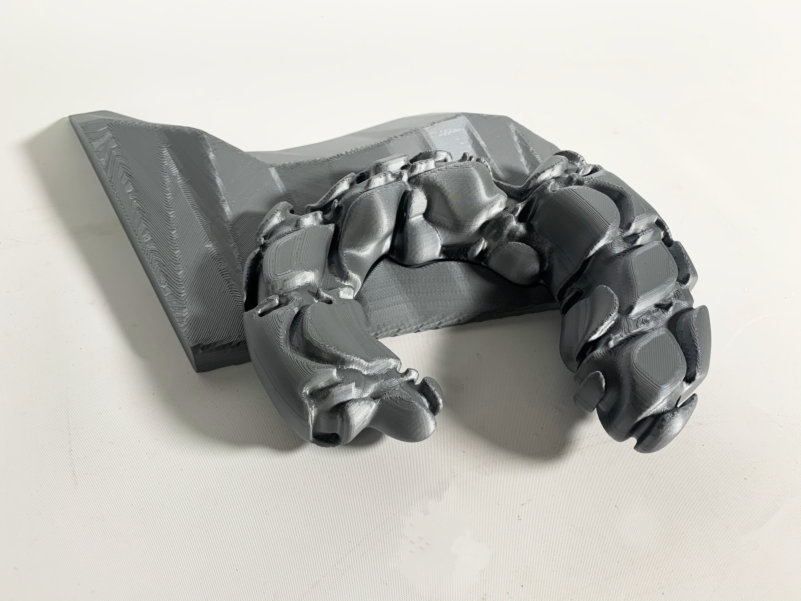

Carnegie Mellon University's School of Architecture's third year Environmental Form Feedback studio focuses on how architecture can shape and respond to its environment.
My project focused on the process of erosion and flooding. Using a form derived from these concepts, I created a museum that allows space for researchers and passerby boats to dock.

